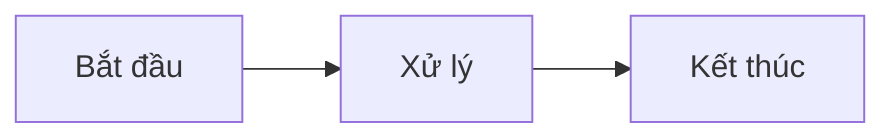

# Tóm Tắt Tài Liệu Diagram - Hệ Thống Đặt Lịch Phòng Khám

## 📋 Tổng Quan

Đã tạo **7 file tài liệu** chứa **hơn 40 diagram** chi tiết về toàn bộ hệ thống Clinic Booking System.

**Vị trí:** `/docs/diagrams/`

**Định dạng:** Mermaid (Markdown) - có thể xem trực tiếp trên GitHub hoặc chuyển đổi thành hình ảnh

---

## 📁 Danh Sách File

### 1. **01-architecture-overview.md** - Kiến Trúc Tổng Quan
📊 **Nội dung:**
- Sơ đồ kiến trúc toàn hệ thống
- Tất cả microservices (User, Appointment, Medical, Payment)
- Database per service pattern
- Hạ tầng (Redis, Kafka)
- Tích hợp bên ngoài (MoMo, VNPay)

🎯 **Dùng để:**
- Hiểu cấu trúc tổng thể
- Setup infrastructure
- Giới thiệu hệ thống cho người mới

---

### 2. **02-user-registration-flow.md** - Luồng Đăng Ký & Xác Thực
📊 **Nội dung:**
- Luồng đăng ký user (Patient, Doctor, Admin)
- Luồng đăng nhập với JWT
- Luồng refresh token
- Event user.created

🔍 **Chi tiết:**
- Validation: email/phone uniqueness, password strength
- Doctor credentials: specialization, licenseNumber required
- JWT token generation & refresh
- Error handling: duplicate email, invalid password, account locked

🎯 **Dùng để:**
- Implement authentication API
- Test user registration
- Hiểu JWT flow

---

### 3. **03-appointment-booking-flow.md** - Luồng Đặt Lịch Hẹn
📊 **Nội dung:**
- Luồng tạo appointment
- Luồng update appointment
- Luồng hủy/xóa appointment
- Appointment status lifecycle
- Doctor schedule validation

🔍 **Chi tiết:**
- Validation: duration (15-180 phút), không quá khứ, không quá 3 tháng
- Kiểm tra doctor schedule & working hours
- Kiểm tra conflict (trùng lịch)
- Soft delete (status = CANCELLED)
- Event publishing

📈 **Lifecycle:**
```
PENDING → CONFIRMED → COMPLETED
   ↓          ↓
CANCELLED (từ bất kỳ trạng thái nào)
```

🎯 **Dùng để:**
- Implement appointment booking API
- Test booking validation
- Hiểu schedule conflict detection

---

### 4. **04-payment-processing-flow.md** - Luồng Thanh Toán (MoMo)
📊 **Nội dung:**
- Luồng tạo payment với MoMo
- MoMo callback webhook processing
- Query payment status
- Luồng refund (hoàn tiền)
- Payment status lifecycle

🔍 **Chi tiết:**
- **Create Payment:**
  - Generate orderId
  - Create MoMo payment request
  - HMAC-SHA256 signature
  - Lưu PaymentOrder & PaymentTransaction
  - Return payUrl, QR code

- **MoMo Callback:**
  - Verify signature (security)
  - Pessimistic lock (prevent duplicate)
  - Idempotency (MoMo có thể retry)
  - Update status: COMPLETED/FAILED
  - Publish event

- **Refund:**
  - Chỉ refund COMPLETED payment
  - Tính remaining amount
  - Call MoMo refund API
  - Update status: REFUNDED/PARTIALLY_REFUNDED

🔒 **Security:**
- HMAC-SHA256 signature verification
- Pessimistic locking
- IP address logging
- Request/response validation

📈 **Lifecycle:**
```
PENDING → COMPLETED → PARTIALLY_REFUNDED → REFUNDED
    ↓            ↘
FAILED/EXPIRED    REFUNDED (full)
```

🎯 **Dùng để:**
- Implement payment gateway integration
- Test payment flow
- Debug MoMo callback issues
- Implement refund logic

---

### 5. **05-medical-record-flow.md** - Luồng Hồ Sơ Bệnh Án
📊 **Nội dung:**
- Luồng tạo medical record
- Thêm prescription
- Xem hồ sơ bệnh án
- Update medical record
- Medication catalog usage

🔍 **Chi tiết:**
- **Create Medical Record:**
  - Validate doctor & patient (Feign call)
  - Validate appointment COMPLETED
  - Create với prescriptions
  - Denormalize patientName, doctorName

- **Prescription:**
  - Use medication catalog (defaults)
  - Override với custom values
  - Manual entry if no catalog

📋 **Authorization:**
- **PATIENT:** Chỉ xem hồ sơ của mình
- **DOCTOR:** Chỉ tạo/sửa hồ sơ của mình
- **ADMIN:** Full access

🗄️ **Database:**
- Medical Records ↔ Prescriptions (1-to-many)
- Prescriptions ↔ Medications (many-to-one optional)

🎯 **Dùng để:**
- Implement medical record API
- Test prescription logic
- Hiểu medication catalog

---

### 6. **06-inter-service-communication.md** - Giao Tiếp Giữa Các Service
📊 **Nội dung:**
- Feign Client architecture
- Circuit breaker patterns
- Fallback strategies
- Service dependencies
- Retry mechanisms
- Load balancing

🔍 **Chi tiết:**
- **Feign Clients:**
  - Appointment → User Service
  - Medical → User Service
  - Medical → Appointment Service

- **Circuit Breaker:**
  - 3 states: CLOSED, OPEN, HALF_OPEN
  - Threshold: 50% failure rate
  - Wait duration: 10s
  - Test calls: 3 in half-open

- **Fallback:**
  - Return default values
  - Prevent cascading failures
  - Log warnings

- **Timeouts:**
  - Connect: 5s
  - Read: 5s

📊 **Dependencies:**
```
Level 0: User Service, Payment Service
Level 1: Appointment Service
Level 2: Medical Service
```

🎯 **Dùng để:**
- Configure Feign clients
- Implement fallback logic
- Debug inter-service calls
- Setup circuit breakers

---

### 7. **07-event-driven-architecture.md** - Kiến Trúc Hướng Sự Kiện
📊 **Nội dung:**
- Kafka event flow overview
- Tất cả event types & payloads
- Event consumers
- Error handling & Dead Letter Queue
- Event ordering & partitioning
- Schema evolution

🔍 **Chi tiết:**

**User Events:**
- `user.created` - User mới được tạo
- `user.updated` - Update thông tin user (denormalize to other services)
- `user.deleted` - User bị xóa (soft delete)

**Appointment Events:**
- `appointment.created` - Lịch hẹn mới
- `appointment.updated` - Update lịch hẹn
- `appointment.cancelled` - Hủy lịch hẹn

**Medical Record Events:**
- `medical_record.created` - Hồ sơ bệnh án mới
- `medical_record.updated` - Update hồ sơ

**Payment Events:**
- `payment.created` - Payment được tạo
- `payment.completed` - Thanh toán thành công
- `payment.failed` - Thanh toán thất bại
- `payment.refunded` - Hoàn tiền thành công

📨 **Event Processing:**
1. Publish to Kafka topic
2. Consumers subscribe
3. Deserialize JSON
4. Process event
5. Retry on failure (max 3)
6. Send to DLQ if still fails

🔑 **Partitioning:**
- Same entity → same partition
- Maintains order
- Parallel processing

🎯 **Dùng để:**
- Implement event publishing
- Setup Kafka consumers
- Debug event processing
- Implement DLQ handling

---

## 🎨 Cách Xem Diagrams

### Cách 1: Trên GitHub (Đơn giản nhất) ⭐
1. Mở file `.md` trên GitHub
2. Diagram tự động hiển thị
3. Không cần cài đặt gì

### Cách 2: VS Code
1. Cài extension: **Markdown Preview Mermaid Support**
2. Mở file `.md`
3. Nhấn `Cmd+Shift+V` (Mac) hoặc `Ctrl+Shift+V` (Windows)

### Cách 3: Mermaid Live Editor
1. Copy code Mermaid từ file
2. Mở https://mermaid.live/
3. Paste và xem

---

## 🖼️ Chuyển Đổi Sang Hình Ảnh

### Tự động (Recommended)

**Bước 1:** Cài Mermaid CLI
```bash
npm install -g @mermaid-js/mermaid-cli
```

**Bước 2:** Chạy script
```bash
cd docs/diagrams
./convert-all.sh
```

**Kết quả:**
- Tất cả diagram được convert sang PNG & SVG
- Lưu trong folder `output/png/` và `output/svg/`

### Thủ công

Convert từng file:
```bash
# PNG
mmdc -i 01-architecture-overview.md -o output/architecture.png

# SVG (chất lượng cao hơn)
mmdc -i 01-architecture-overview.md -o output/architecture.svg

# PDF
mmdc -i 01-architecture-overview.md -o output/architecture.pdf
```

### Dùng Docker (không cần Node.js)
```bash
docker pull minlag/mermaid-cli

docker run --rm -v $(pwd):/data minlag/mermaid-cli \
  -i /data/01-architecture-overview.md \
  -o /data/output/architecture.png
```

---

## 📊 Thống Kê

- **Tổng số file:** 7 files
- **Tổng số diagram:** 40+ diagrams
- **Loại diagram:**
  - Architecture diagrams: 5
  - Sequence diagrams: 20+
  - State diagrams: 5
  - Flowcharts: 8
  - ER diagram: 1
  - Event flow diagrams: 5+

- **Dòng code Mermaid:** ~3,000 dòng
- **Thời gian tạo:** ~2 giờ
- **Format:** Mermaid (Markdown)

---

## 💡 Use Cases

### Cho Developers
- Hiểu flow trước khi code
- Reference khi implement API
- Debug issues
- Code review

### Cho QA/Testers
- Viết test cases
- Test validation rules
- Test error scenarios
- Test state transitions

### Cho DevOps
- Setup infrastructure
- Configure services
- Monitor systems
- Troubleshoot issues

### Cho Project Managers
- Hiểu business processes
- Estimate efforts
- Plan sprints
- Present to stakeholders

### Cho Documentation
- Technical docs
- API documentation
- System design docs
- Training materials

---

## 🔧 Chỉnh Sửa Diagrams

Tất cả diagrams dùng Mermaid syntax - rất dễ edit:

**Ví dụ:**


**Syntax cơ bản:**
- `graph LR` - Left to Right flowchart
- `graph TD` - Top to Down flowchart
- `sequenceDiagram` - Sequence diagram
- `stateDiagram-v2` - State diagram
- `erDiagram` - ER diagram

Xem full docs: https://mermaid.js.org/

---

## ✅ Checklist

- [x] Architecture overview diagram
- [x] User registration & authentication flows
- [x] Appointment booking flows
- [x] Payment processing flows (MoMo integration)
- [x] Medical record flows
- [x] Inter-service communication diagrams
- [x] Event-driven architecture diagrams
- [x] README với hướng dẫn chi tiết
- [x] Script tự động convert sang image
- [x] Tài liệu tiếng Việt (file này)

---

## 📚 Tài Nguyên Bổ Sung

- **Mermaid Docs:** https://mermaid.js.org/
- **Mermaid Live Editor:** https://mermaid.live/
- **Mermaid Cheat Sheet:** https://jojozhuang.github.io/tutorial/mermaid-cheat-sheet/
- **CRUD Implementation Guide:** `../../README_CRUD_IMPLEMENTATION.md`
- **System README:** `../../README.md`

---

## 🎯 Kết Luận

Toàn bộ hệ thống đã được document chi tiết qua diagrams:
- ✅ **Architecture** - Hiểu rõ cấu trúc hệ thống
- ✅ **Flows** - Hiểu rõ business processes
- ✅ **APIs** - Hiểu rõ request/response
- ✅ **Events** - Hiểu rõ async communication
- ✅ **Validation** - Hiểu rõ business rules
- ✅ **Security** - Hiểu rõ authentication & authorization
- ✅ **Error Handling** - Hiểu rõ error scenarios

Bạn có thể:
1. ✅ Xem trực tiếp trên GitHub
2. ✅ Xem trong VS Code
3. ✅ Convert sang PNG/SVG/PDF
4. ✅ Dùng trong presentations
5. ✅ Dùng trong documentation
6. ✅ Chia sẻ với team

---

**Ngày tạo:** 21/01/2026
**Trạng thái:** ✅ Hoàn thành
**Tác giả:** Claude Code
**Phiên bản:** 1.0.0
