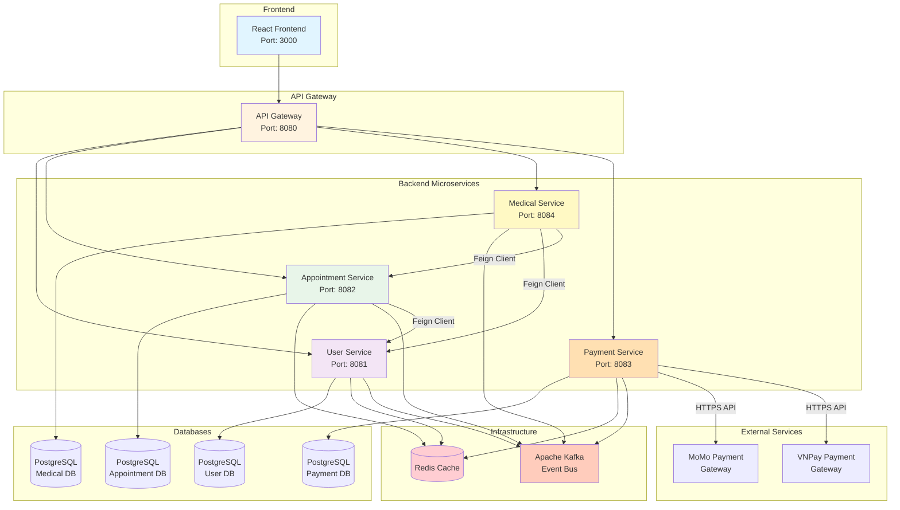

# Architecture Overview

## Components

### Frontend
- **React Frontend**: User interface for patients, doctors, and admins
- Port: 3000

### API Gateway
- **API Gateway**: Routes requests to appropriate microservices
- Port: 8080
- Handles JWT authentication and authorization

### Backend Services
- **User Service** (Port 8081): User management, authentication, authorization
- **Appointment Service** (Port 8082): Appointment booking and scheduling
- **Medical Service** (Port 8084): Medical records, prescriptions, health metrics
- **Payment Service** (Port 8083): Payment processing with MoMo/VNPay

### Databases
- Each service has its own PostgreSQL database (Database per Service pattern)
- Schema isolation and independent scaling

### Infrastructure
- **Redis**: Distributed caching for performance
- **Apache Kafka**: Event-driven communication between services

### External Services
- **MoMo Payment Gateway**: Mobile payment processing
- **VNPay Gateway**: Bank card payment processing

## Communication Patterns

1. **Synchronous**:
   - Frontend ↔ Gateway ↔ Services (REST API)
   - Inter-service via Feign Clients

2. **Asynchronous**:
   - Services ↔ Kafka (Event publishing/consumption)

3. **Caching**:
   - Services ↔ Redis (Read-through cache)
