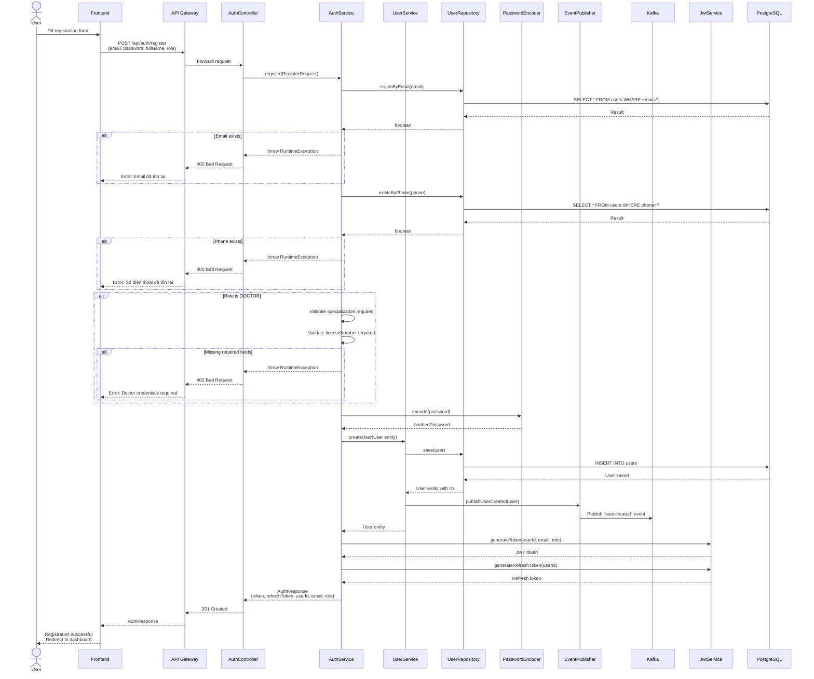
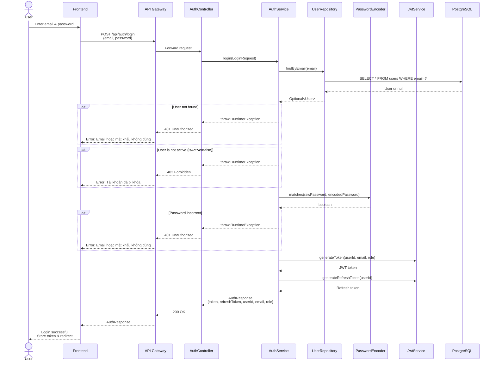
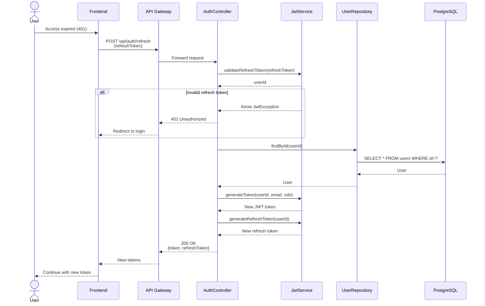
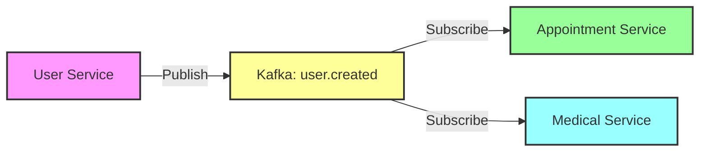

# User Registration and Authentication Flow

## User Registration Flow



## User Login Flow



## Token Refresh Flow



## Event: User Created



**Event Payload:**
```json
{
  "userId": 123,
  "email": "user@example.com",
  "fullName": "Nguyen Van A",
  "phone": "0901234567",
  "role": "PATIENT",
  "timestamp": "2026-01-21T10:00:00",
  "eventType": "CREATED"
}
```

## Error Handling Summary

| Error | HTTP Status | Message |
|-------|-------------|---------|
| Email exists | 400 Bad Request | Email đã tồn tại |
| Phone exists | 400 Bad Request | Số điện thoại đã tồn tại |
| Missing doctor credentials | 400 Bad Request | Chuyên khoa/Số giấy phép không được để trống cho bác sĩ |
| User not found | 401 Unauthorized | Email hoặc mật khẩu không đúng |
| Wrong password | 401 Unauthorized | Email hoặc mật khẩu không đúng |
| Account locked | 403 Forbidden | Tài khoản đã bị khóa |
| Invalid token | 401 Unauthorized | Token không hợp lệ hoặc đã hết hạn |
