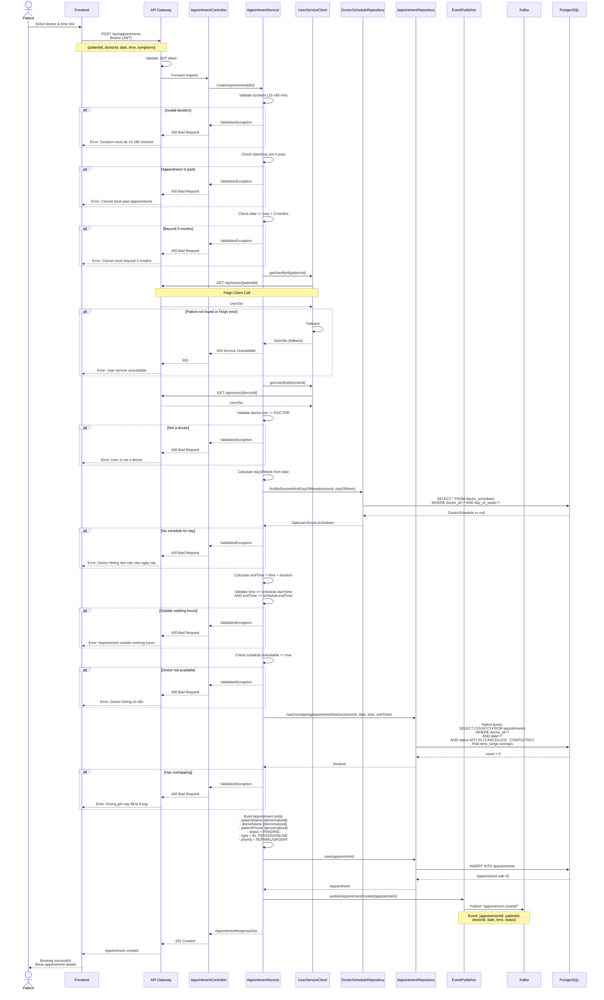
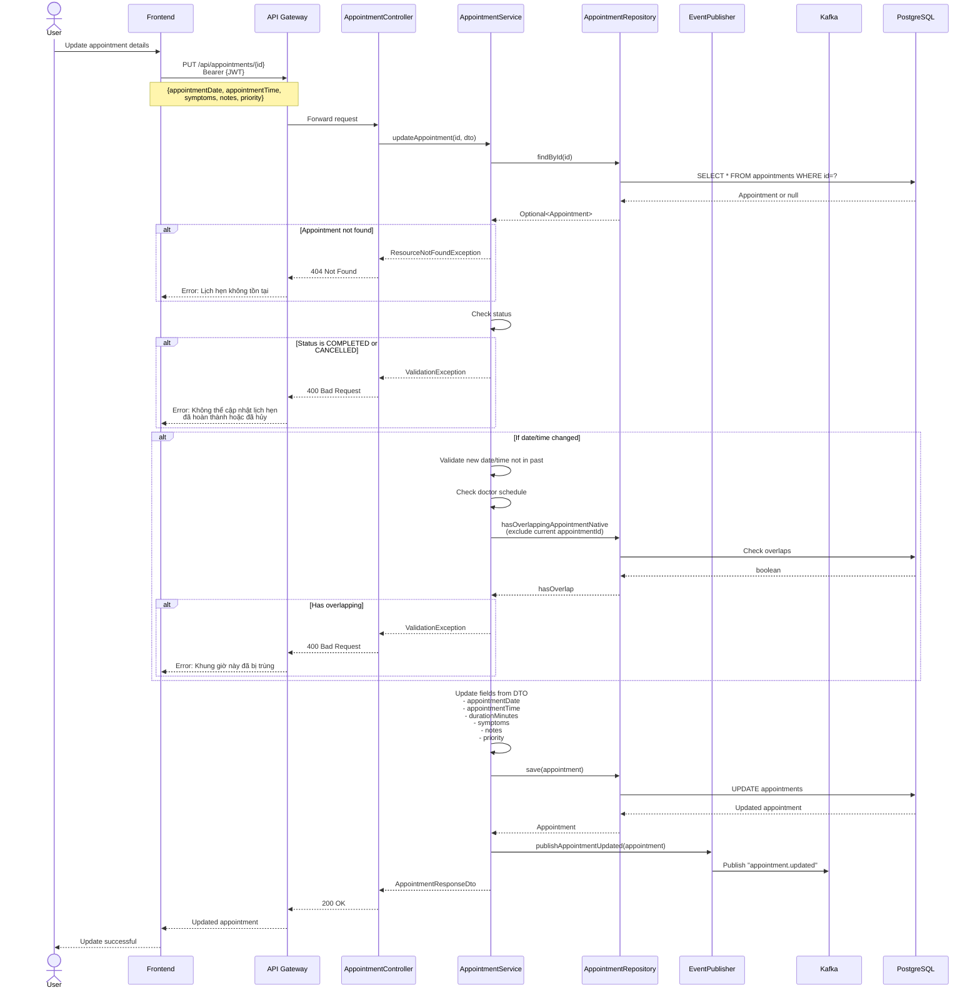
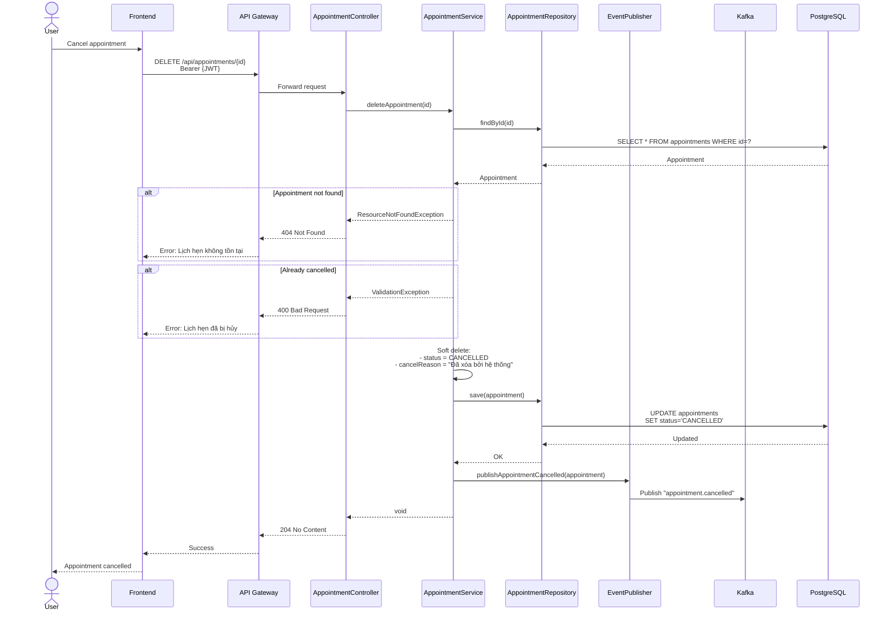
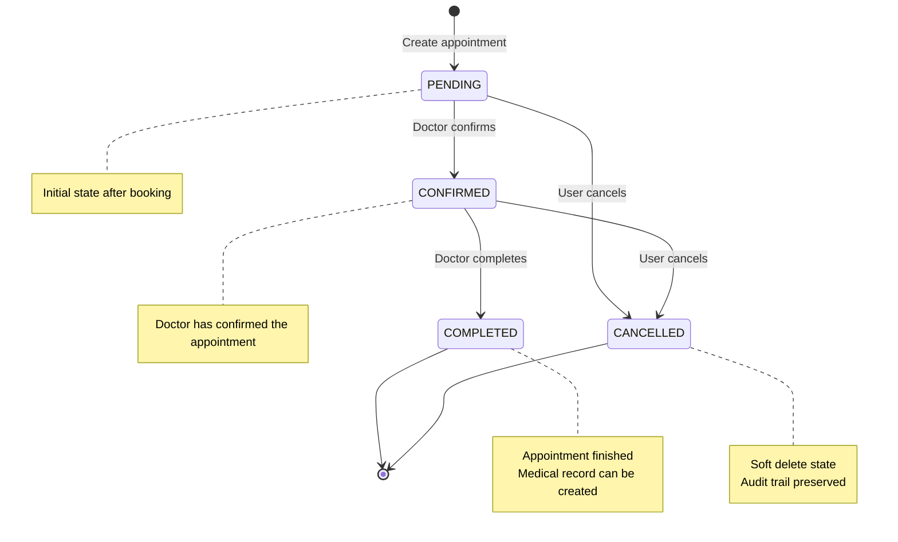
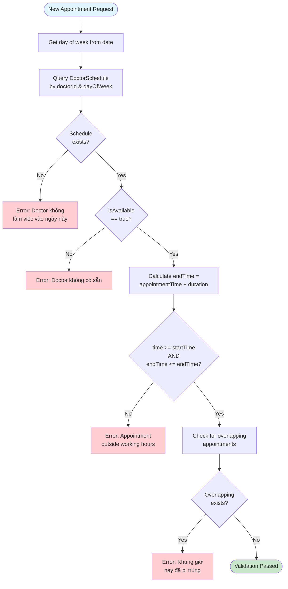
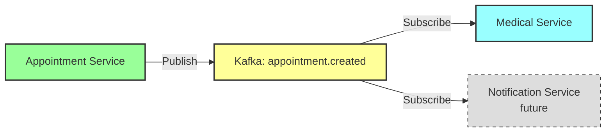

# Appointment Booking Flow

## Create Appointment Flow



## Update Appointment Flow



## Cancel/Delete Appointment Flow



## Appointment Status Lifecycle



## Doctor Schedule Validation



## Event: Appointment Created



**Event Payload:**
```json
{
  "appointmentId": 123,
  "patientId": 10,
  "doctorId": 5,
  "patientName": "Nguyen Van A",
  "doctorName": "Dr. Tran Thi B",
  "appointmentDate": "2026-02-15",
  "appointmentTime": "14:00:00",
  "status": "PENDING",
  "type": "IN_PERSON",
  "timestamp": "2026-01-21T10:30:00",
  "eventType": "CREATED"
}
```

## Error Handling Summary

| Error | HTTP Status | Message |
|-------|-------------|---------|
| Invalid duration | 400 Bad Request | Duration must be 15-180 minutes |
| Past appointment | 400 Bad Request | Cannot book appointments in the past |
| Beyond 3 months | 400 Bad Request | Cannot book beyond 3 months |
| User not found | 503 Service Unavailable | User service unavailable |
| Not a doctor | 400 Bad Request | User is not a doctor |
| No schedule | 400 Bad Request | Doctor không làm việc vào ngày này |
| Outside working hours | 400 Bad Request | Appointment outside working hours |
| Doctor unavailable | 400 Bad Request | Doctor không có sẵn |
| Time conflict | 400 Bad Request | Khung giờ này đã bị trùng |
| Cannot update completed | 400 Bad Request | Không thể cập nhật lịch hẹn đã hoàn thành |
| Already cancelled | 400 Bad Request | Lịch hẹn đã bị hủy |
