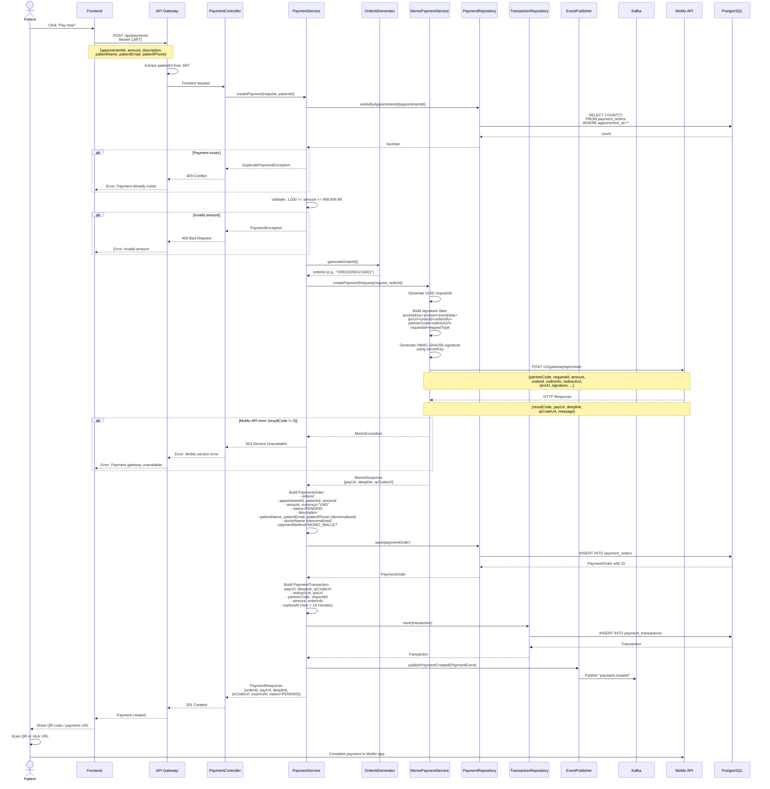
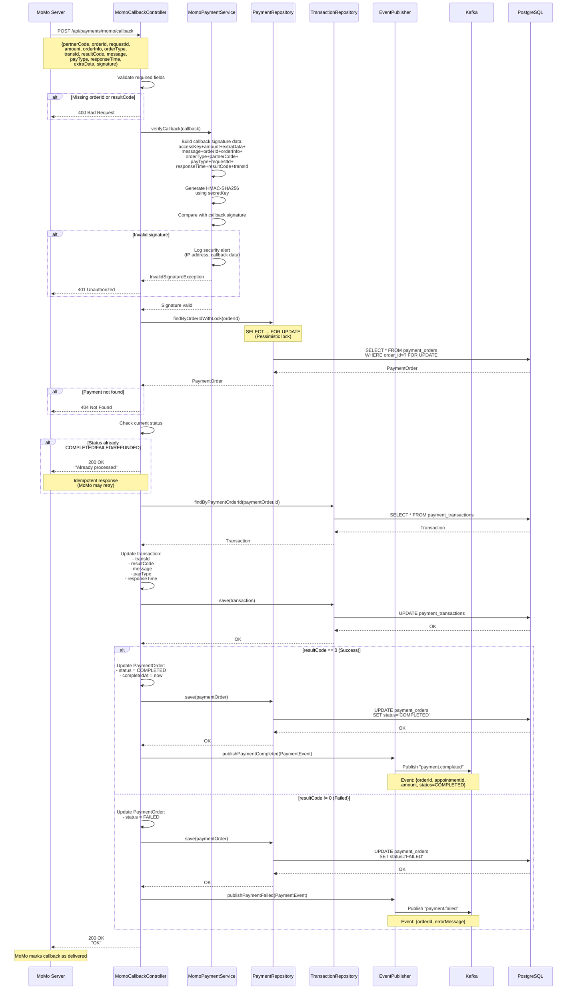
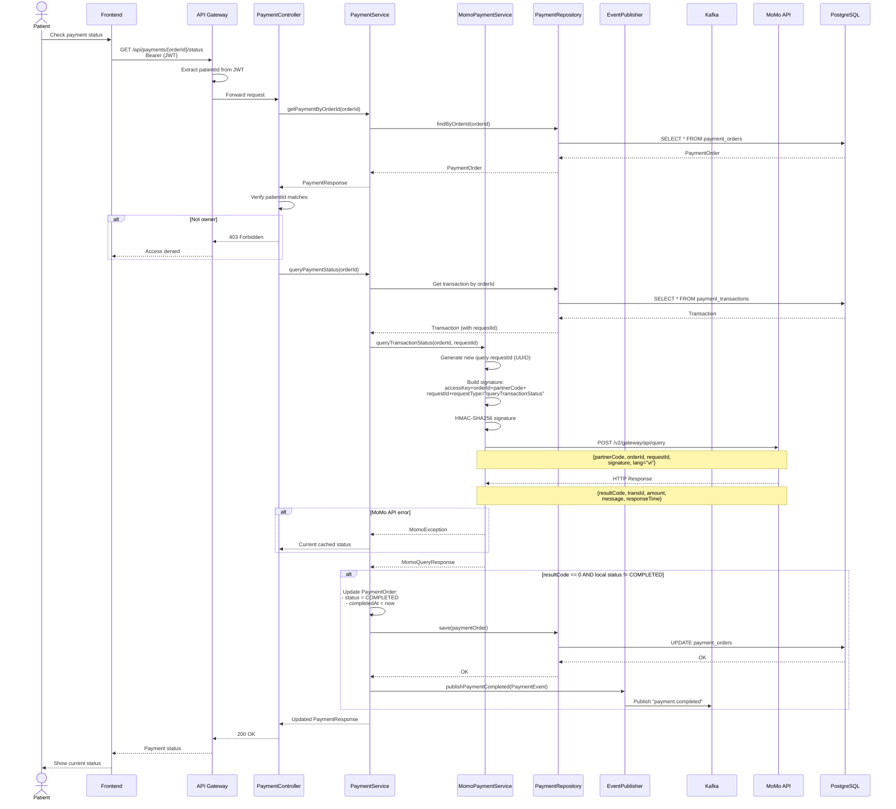
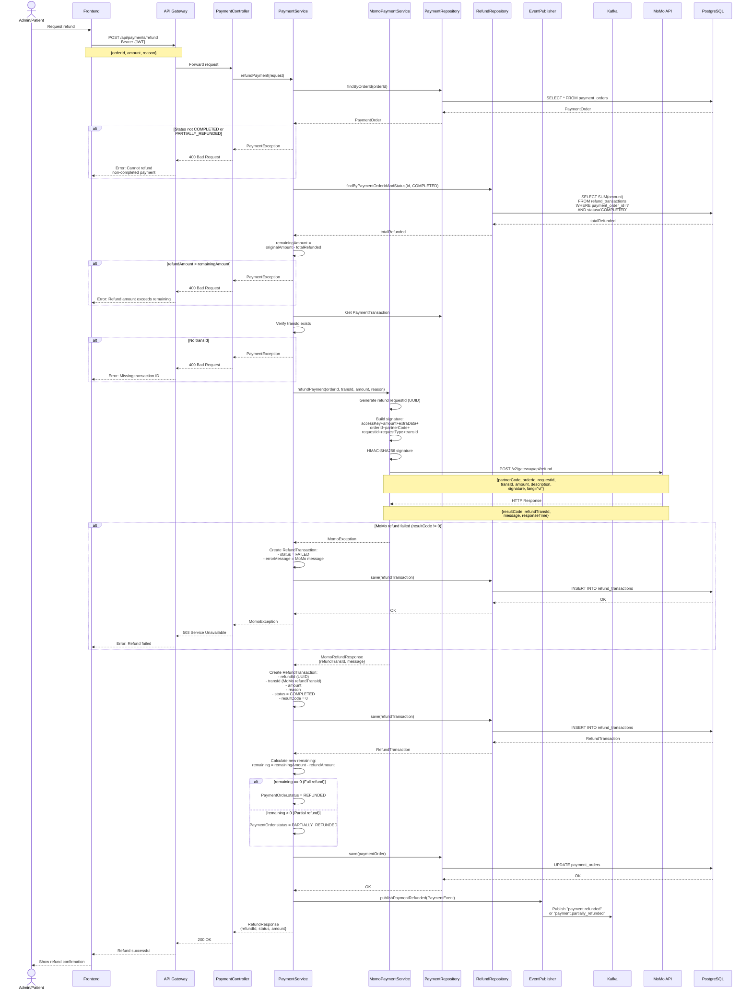
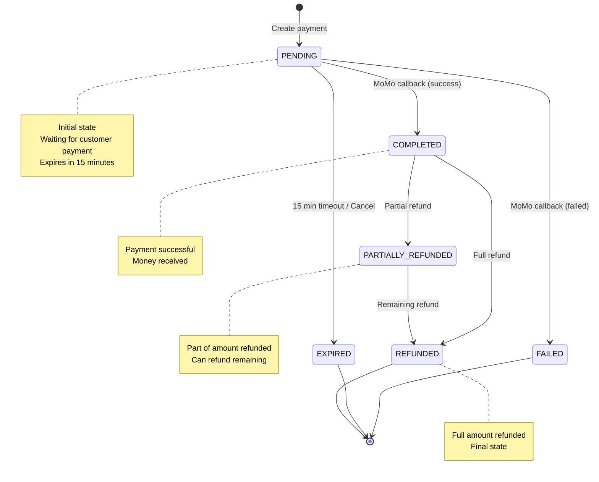
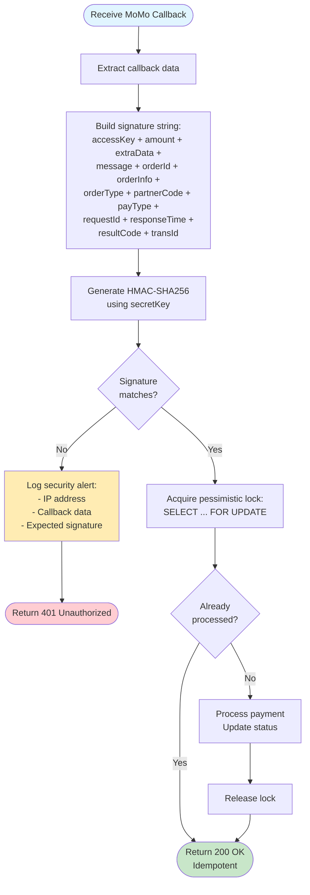

# Payment Processing Flow (MoMo Integration)

## Create Payment Flow

## MoMo Callback Webhook Flow

## Query Payment Status Flow

## Refund Payment Flow

## Payment Status Lifecycle

## Security: Signature Verification

## Error Handling Summary

| Error | HTTP Status | Message |
|-------|-------------|---------|
| Duplicate payment | 409 Conflict | Payment already exists for appointment |
| Invalid amount | 400 Bad Request | Amount must be between 1,000 and 999,999.99 |
| MoMo API error | 503 Service Unavailable | Payment gateway unavailable |
| Invalid signature | 401 Unauthorized | Invalid callback signature |
| Payment not found | 404 Not Found | Order ID not found |
| Cannot refund | 400 Bad Request | Cannot refund non-completed payment |
| Refund exceeds | 400 Bad Request | Refund amount exceeds remaining balance |
| Missing transId | 400 Bad Request | Missing transaction ID for refund |

## Caching Strategy

- **Cache Key**: `paymentOrders::{orderId}`
- **TTL**: 10 minutes
- **Eviction**: On all state changes (callback, query, refund, cancel)
- **Lock**: Pessimistic lock on callback processing to prevent race conditions
