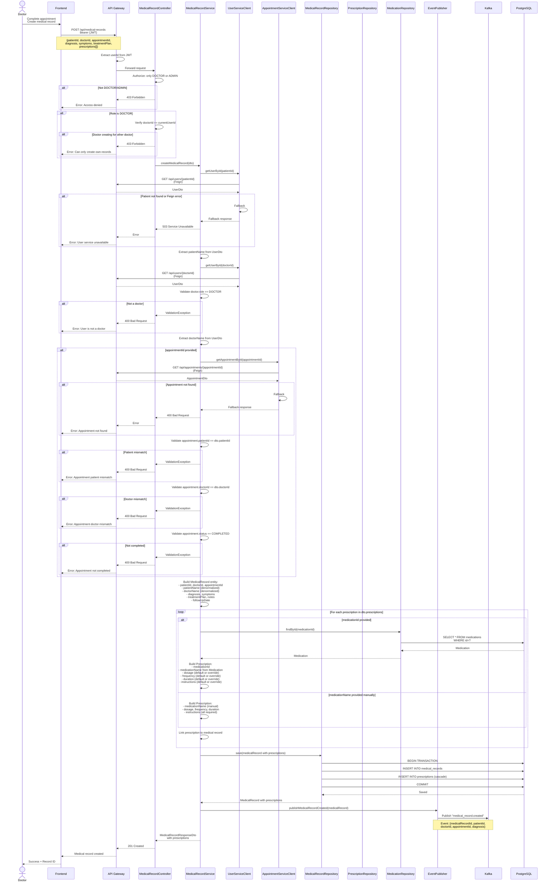
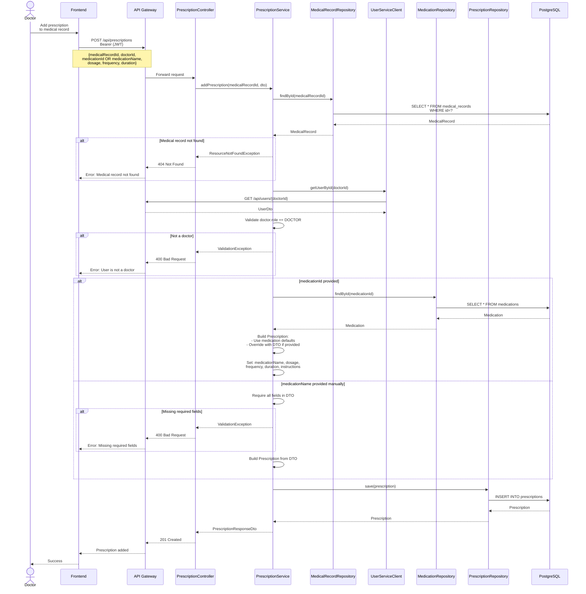
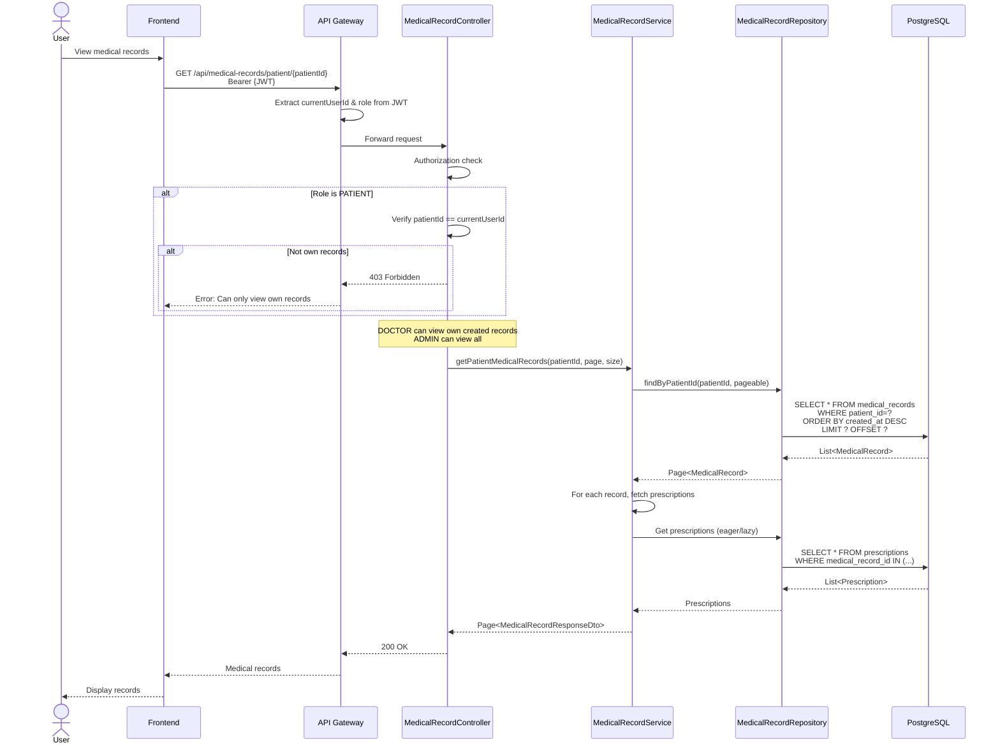
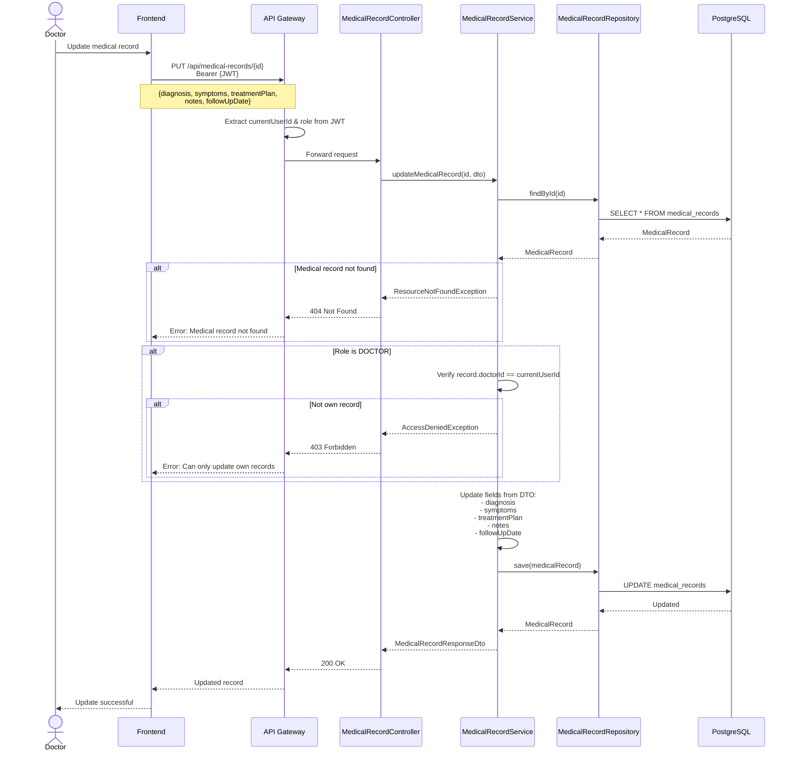
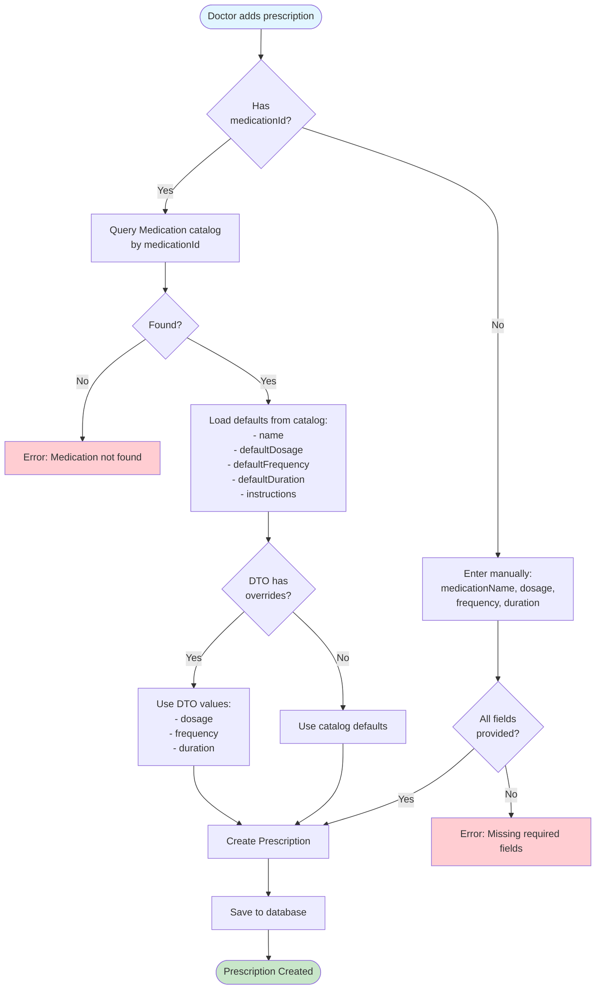
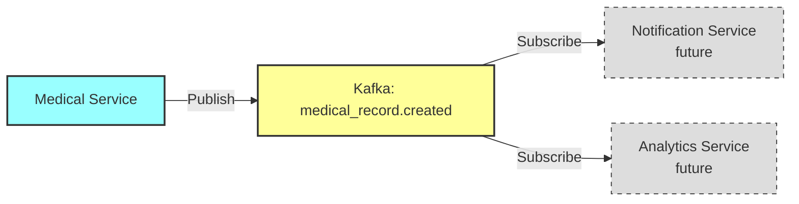
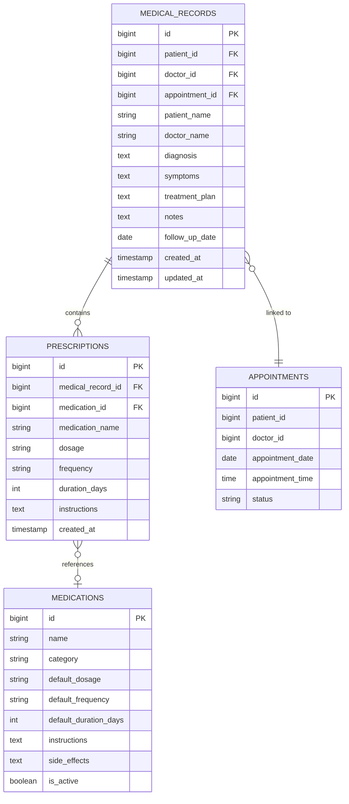

# Medical Record and Prescription Flow

## Create Medical Record Flow



## Add Prescription to Existing Medical Record



## Get Patient Medical Records



## Update Medical Record



## Medication Catalog Usage



## Authorization Matrix

| Role | Create Record | View Own Records | View All Records | Update Own Records | Update All Records | Delete Records |
|------|---------------|------------------|------------------|--------------------|--------------------|----------------|
| **PATIENT** | ❌ | ✅ | ❌ | ❌ | ❌ | ❌ |
| **DOCTOR** | ✅ (own only) | ✅ (own created) | ❌ | ✅ (own only) | ❌ | ❌ |
| **ADMIN** | ✅ | ✅ | ✅ | ✅ | ✅ | ✅ |

## Event: Medical Record Created



**Event Payload:**
```json
{
  "medicalRecordId": 456,
  "patientId": 10,
  "doctorId": 5,
  "appointmentId": 123,
  "diagnosis": "Hypertension",
  "prescriptionCount": 2,
  "timestamp": "2026-01-21T15:30:00",
  "eventType": "CREATED"
}
```

## Database Schema



## Error Handling Summary

| Error | HTTP Status | Message |
|-------|-------------|---------|
| Not authorized | 403 Forbidden | Only DOCTOR/ADMIN can create records |
| Doctor creating for other | 403 Forbidden | Can only create own records |
| User service unavailable | 503 Service Unavailable | User service unavailable |
| Not a doctor | 400 Bad Request | User is not a doctor |
| Appointment not found | 400 Bad Request | Appointment not found |
| Patient mismatch | 400 Bad Request | Appointment patient mismatch |
| Doctor mismatch | 400 Bad Request | Appointment doctor mismatch |
| Appointment not completed | 400 Bad Request | Appointment must be completed |
| Medication not found | 404 Not Found | Medication not found in catalog |
| Missing required fields | 400 Bad Request | All prescription fields required |
| Medical record not found | 404 Not Found | Medical record not found |
| Not own record | 403 Forbidden | Can only update own records |
| Patient viewing others | 403 Forbidden | Can only view own medical records |
