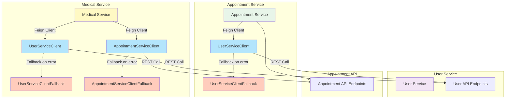
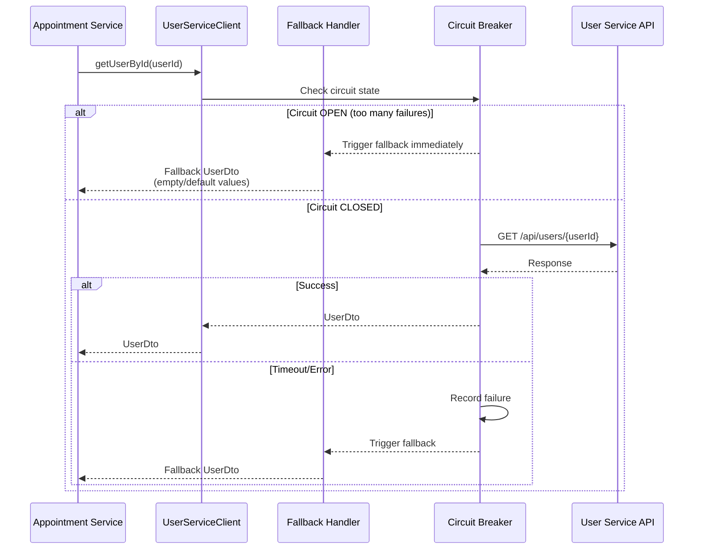
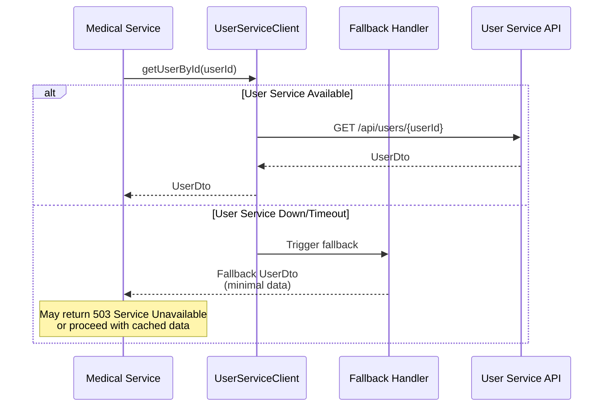
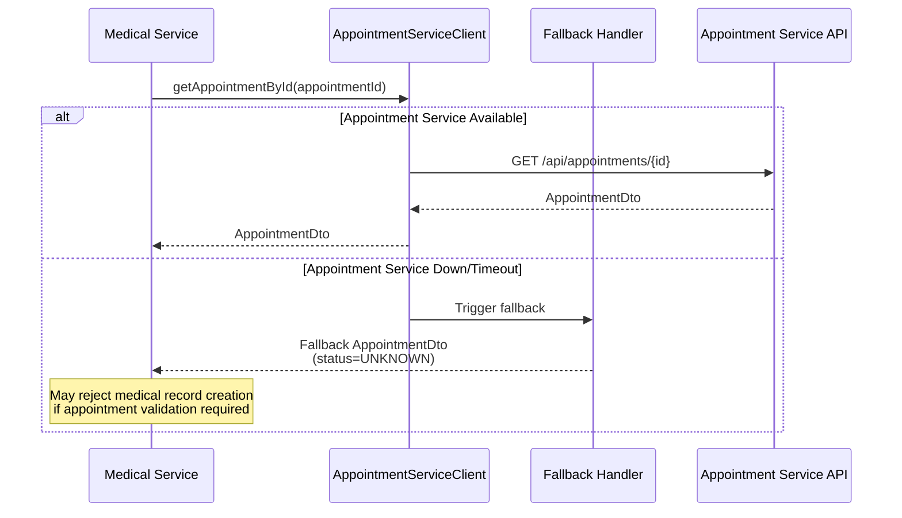
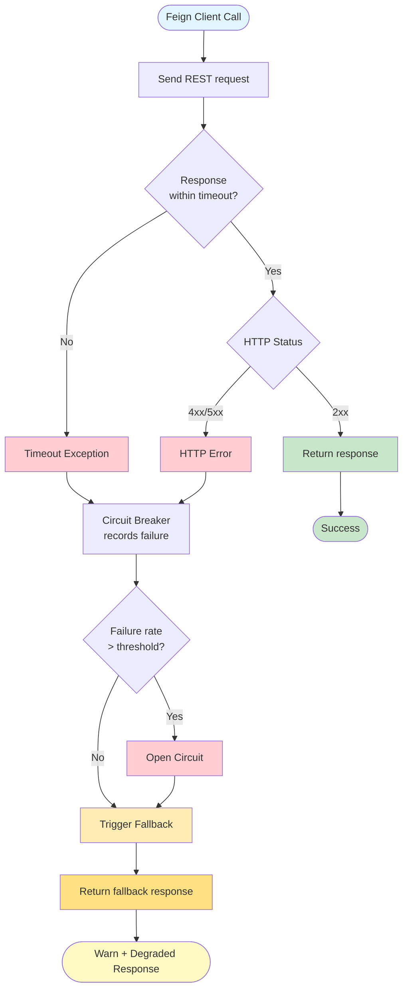
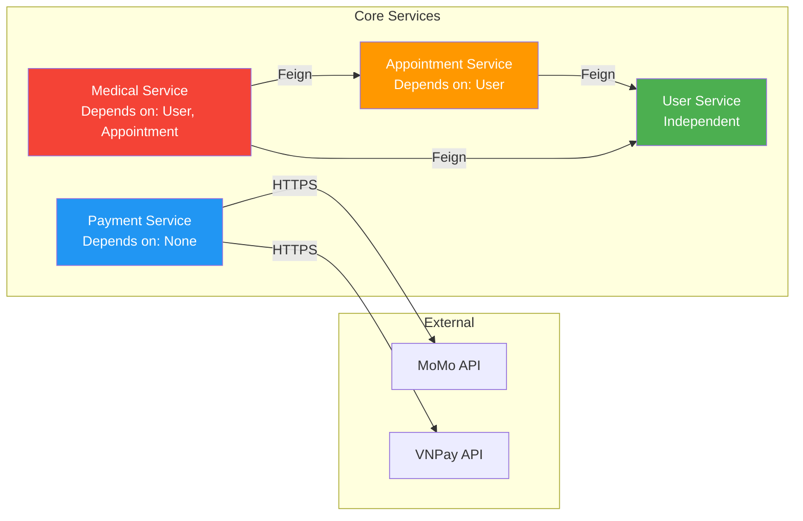
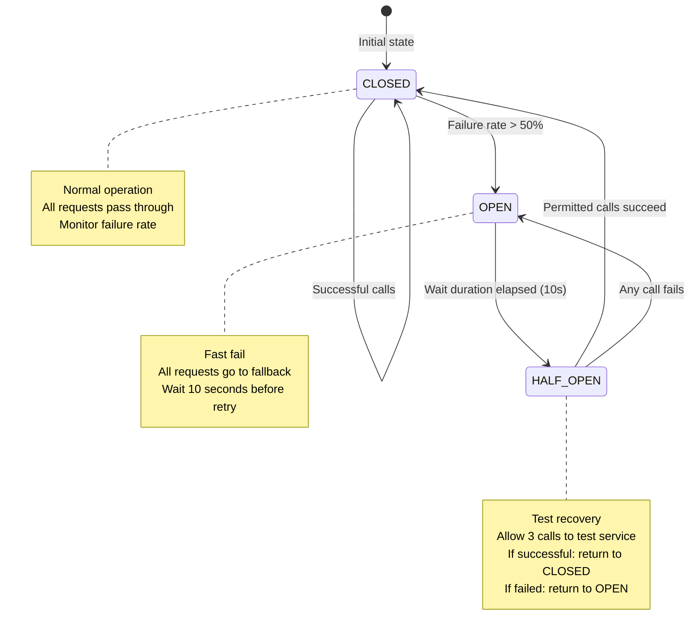
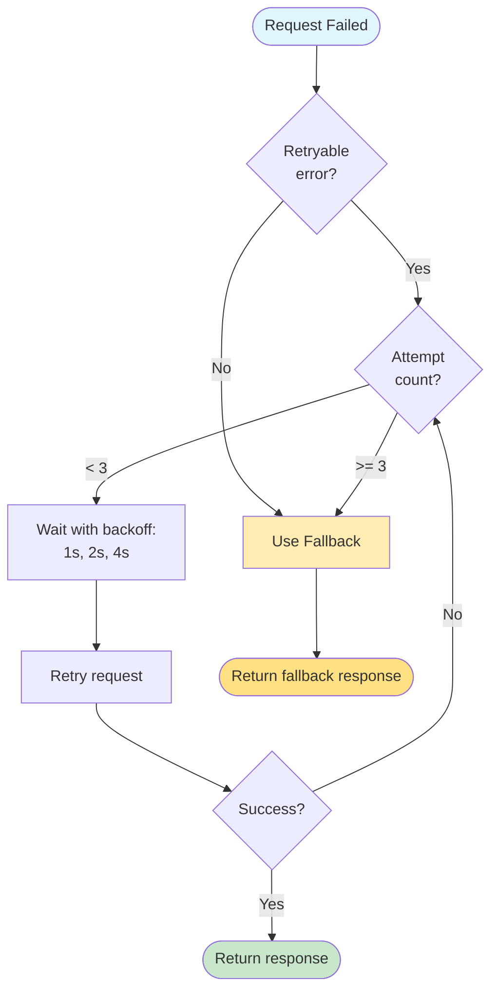
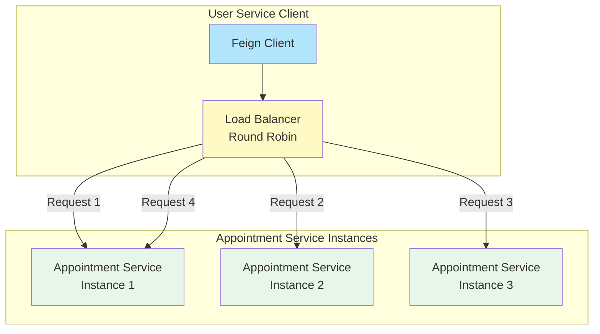
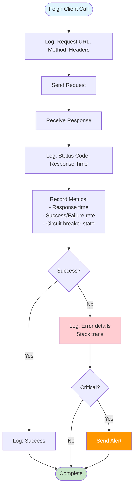

# Inter-Service Communication

## Synchronous Communication (Feign Clients)



## Feign Client Details

### From Appointment Service to User Service



**UserServiceClient Methods:**
- `getUserById(Long userId)` → `UserDto`
- `getUserStatistics()` → `UserStatisticsDto`

**Fallback Behavior:**
```java
// UserServiceClientFallback
@Override
public UserDto getUserById(Long userId) {
    log.warn("Fallback: User service unavailable for userId: {}", userId);
    return UserDto.builder()
        .id(userId)
        .fullName("Unknown User")
        .email("unavailable@service.com")
        .role(UserRole.PATIENT)
        .build();
}

@Override
public UserStatisticsDto getUserStatistics() {
    log.warn("Fallback: User service unavailable. Returning empty statistics");
    return UserStatisticsDto.builder()
        .totalUsers(0L)
        .totalPatients(0L)
        .totalDoctors(0L)
        // ... all 0 values
        .build();
}
```

### From Medical Service to User Service



### From Medical Service to Appointment Service



**AppointmentServiceClient Methods:**
- `getAppointmentById(Long appointmentId)` → `AppointmentDto`

**Fallback Behavior:**
```java
// AppointmentServiceClientFallback
@Override
public AppointmentDto getAppointmentById(Long appointmentId) {
    log.warn("Fallback: Appointment service unavailable for appointmentId: {}", appointmentId);
    return AppointmentDto.builder()
        .id(appointmentId)
        .status("UNKNOWN")
        .build();
}
```

## Feign Configuration

```yaml
feign:
  client:
    config:
      default:
        connectTimeout: 5000      # 5 seconds
        readTimeout: 5000         # 5 seconds
        loggerLevel: BASIC
  circuitbreaker:
    enabled: true

resilience4j:
  circuitbreaker:
    instances:
      userService:
        slidingWindowSize: 10
        failureRateThreshold: 50
        waitDurationInOpenState: 10s
        permittedNumberOfCallsInHalfOpenState: 3
      appointmentService:
        slidingWindowSize: 10
        failureRateThreshold: 50
        waitDurationInOpenState: 10s
```

## Error Handling Flow



## Service Dependencies Graph



**Dependency Levels:**
- **Level 0** (No dependencies): User Service, Payment Service
- **Level 1** (Depends on Level 0): Appointment Service
- **Level 2** (Depends on Level 1): Medical Service

**Startup Order:**
1. Start User Service
2. Start Appointment Service & Payment Service (can be parallel)
3. Start Medical Service

## Circuit Breaker States



## Retry Strategy



**Retryable Errors:**
- Connection timeout
- Socket timeout
- HTTP 503 (Service Unavailable)
- HTTP 504 (Gateway Timeout)

**Non-Retryable Errors:**
- HTTP 400 (Bad Request)
- HTTP 401 (Unauthorized)
- HTTP 403 (Forbidden)
- HTTP 404 (Not Found)

## Load Balancing



**Load Balancing Strategy:**
- **Algorithm**: Round Robin (default)
- **Service Discovery**: Can integrate with Eureka/Consul
- **Health Check**: Enabled (exclude unhealthy instances)

## Request/Response DTOs

### UserDto
```json
{
  "id": 123,
  "email": "user@example.com",
  "fullName": "Nguyen Van A",
  "phone": "0901234567",
  "role": "PATIENT",
  "specialization": "Cardiology",
  "licenseNumber": "MD12345",
  "isActive": true
}
```

### AppointmentDto
```json
{
  "id": 456,
  "patientId": 10,
  "doctorId": 5,
  "patientName": "Nguyen Van A",
  "doctorName": "Dr. Tran Thi B",
  "appointmentDate": "2026-02-15",
  "appointmentTime": "14:00:00",
  "status": "COMPLETED",
  "type": "IN_PERSON"
}
```

### UserStatisticsDto
```json
{
  "totalUsers": 1500,
  "totalPatients": 1200,
  "totalDoctors": 50,
  "activeUsers": 1450,
  "inactiveUsers": 50,
  "newUsersThisMonth": 120,
  "newPatientsThisMonth": 100,
  "newDoctorsThisMonth": 5,
  "emailVerifiedUsers": 1000,
  "phoneVerifiedUsers": 800
}
```

## Monitoring and Logging



## Best Practices Summary

1. **Always implement fallbacks** - Never let Feign client failures crash the service
2. **Use circuit breakers** - Prevent cascading failures
3. **Set appropriate timeouts** - 5 seconds for read/connect
4. **Enable retry with backoff** - For transient failures
5. **Log all Feign calls** - For debugging and monitoring
6. **Cache responses when possible** - Reduce inter-service calls
7. **Use DTOs for communication** - Don't expose internal entities
8. **Version your APIs** - Prevent breaking changes
9. **Implement health checks** - Monitor service availability
10. **Use service discovery** - For dynamic service location
