# Event-Driven Architecture (Kafka)

## Event Flow Overview

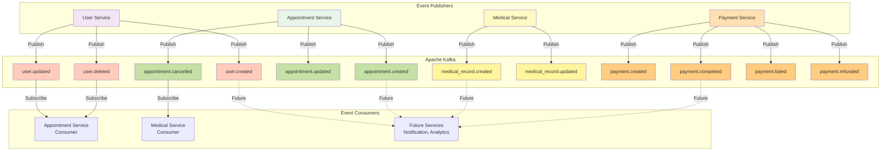

## User Events

### User Created Event

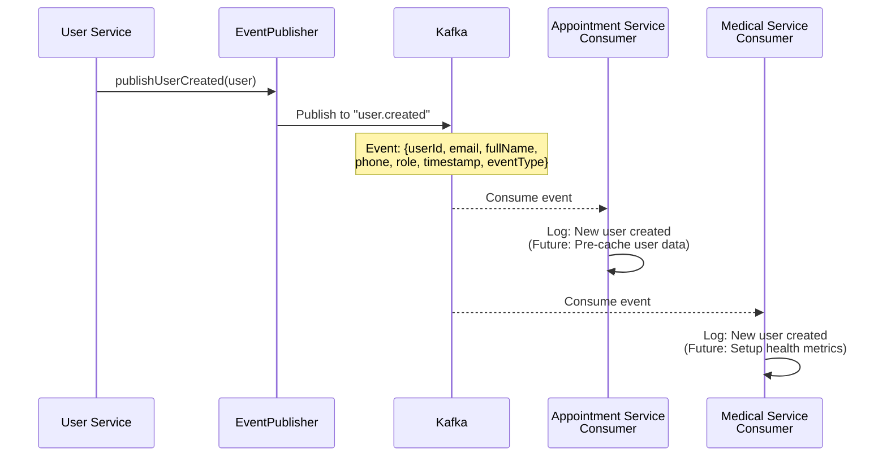

**Event Payload:**
```json
{
  "userId": 123,
  "email": "newuser@example.com",
  "fullName": "Nguyen Van A",
  "phone": "0901234567",
  "role": "PATIENT",
  "specialization": null,
  "licenseNumber": null,
  "timestamp": "2026-01-21T10:00:00",
  "eventType": "CREATED"
}
```

### User Updated Event

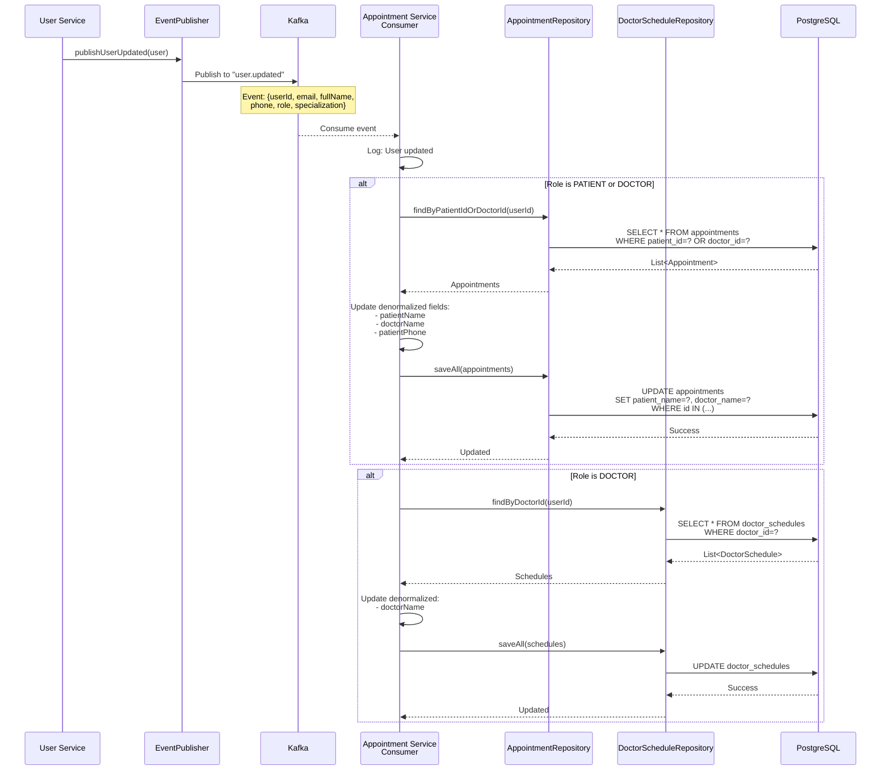

**Event Payload:**
```json
{
  "userId": 123,
  "email": "updated@example.com",
  "fullName": "Nguyen Van A (Updated)",
  "phone": "0912345678",
  "role": "PATIENT",
  "specialization": null,
  "timestamp": "2026-01-21T11:00:00",
  "eventType": "UPDATED"
}
```

### User Deleted Event

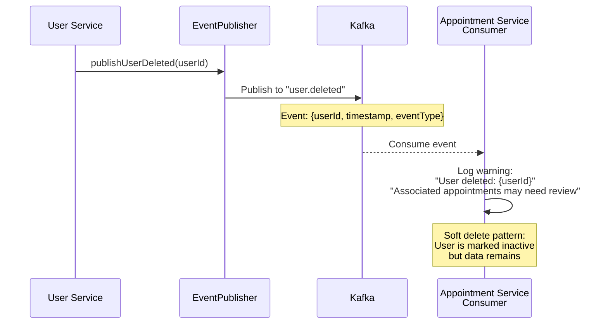

**Event Payload:**
```json
{
  "userId": 123,
  "timestamp": "2026-01-21T12:00:00",
  "eventType": "DELETED"
}
```

## Appointment Events

### Appointment Created Event

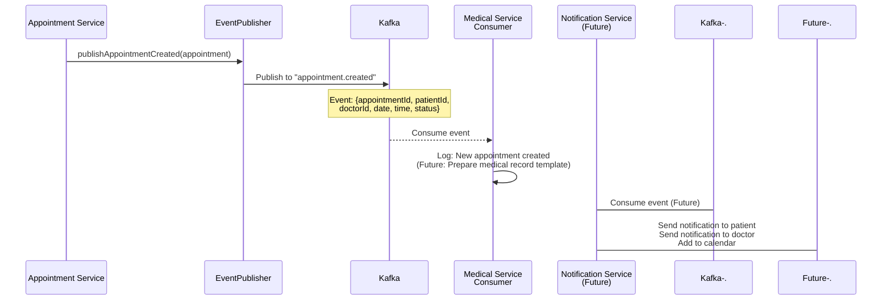

**Event Payload:**
```json
{
  "appointmentId": 456,
  "patientId": 10,
  "doctorId": 5,
  "patientName": "Nguyen Van A",
  "doctorName": "Dr. Tran Thi B",
  "appointmentDate": "2026-02-15",
  "appointmentTime": "14:00:00",
  "durationMinutes": 30,
  "status": "PENDING",
  "type": "IN_PERSON",
  "priority": "NORMAL",
  "timestamp": "2026-01-21T10:30:00",
  "eventType": "CREATED"
}
```

### Appointment Updated Event

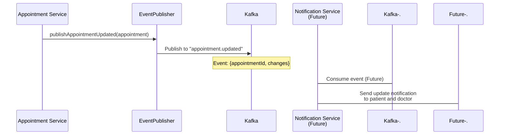

**Event Payload:**
```json
{
  "appointmentId": 456,
  "patientId": 10,
  "doctorId": 5,
  "appointmentDate": "2026-02-15",
  "appointmentTime": "15:00:00",
  "status": "CONFIRMED",
  "changedFields": ["appointmentTime", "status"],
  "timestamp": "2026-01-21T11:00:00",
  "eventType": "UPDATED"
}
```

### Appointment Cancelled Event

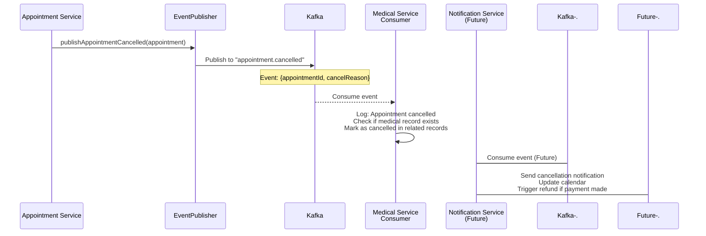

**Event Payload:**
```json
{
  "appointmentId": 456,
  "patientId": 10,
  "doctorId": 5,
  "status": "CANCELLED",
  "cancelReason": "Patient requested cancellation",
  "cancelledAt": "2026-01-21T12:00:00",
  "timestamp": "2026-01-21T12:00:00",
  "eventType": "CANCELLED"
}
```

## Medical Record Events

### Medical Record Created Event

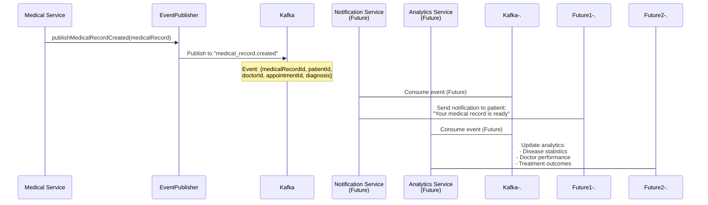

**Event Payload:**
```json
{
  "medicalRecordId": 789,
  "patientId": 10,
  "doctorId": 5,
  "appointmentId": 456,
  "diagnosis": "Hypertension",
  "prescriptionCount": 2,
  "hasFollowUp": true,
  "followUpDate": "2026-03-15",
  "timestamp": "2026-01-21T15:30:00",
  "eventType": "CREATED"
}
```

### Medical Record Updated Event

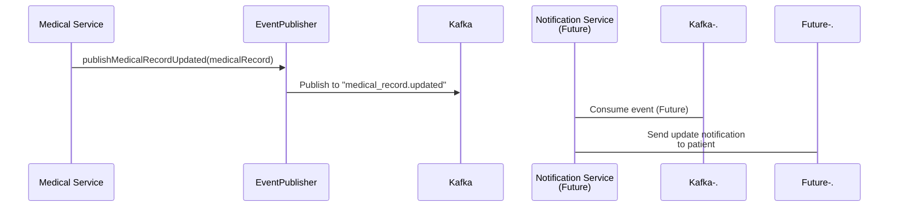

**Event Payload:**
```json
{
  "medicalRecordId": 789,
  "patientId": 10,
  "doctorId": 5,
  "updatedFields": ["diagnosis", "treatmentPlan"],
  "timestamp": "2026-01-21T16:00:00",
  "eventType": "UPDATED"
}
```

## Payment Events

### Payment Created Event

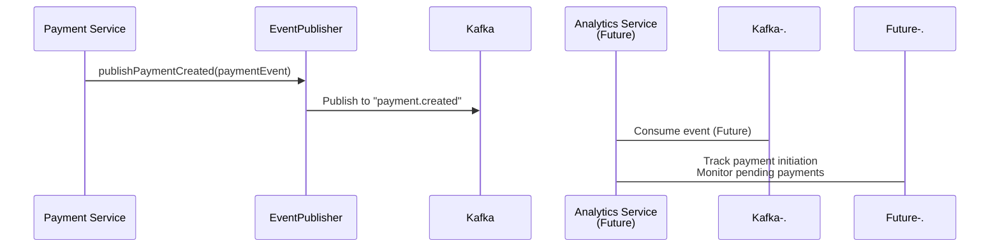

**Event Payload:**
```json
{
  "eventType": "payment.created",
  "timestamp": "2026-01-21T10:00:00",
  "data": {
    "orderId": "ORD202601210001",
    "appointmentId": 123,
    "patientId": 10,
    "doctorId": 5,
    "amount": 500000,
    "currency": "VND",
    "paymentMethod": "MOMO_WALLET",
    "status": "PENDING"
  }
}
```

### Payment Completed Event

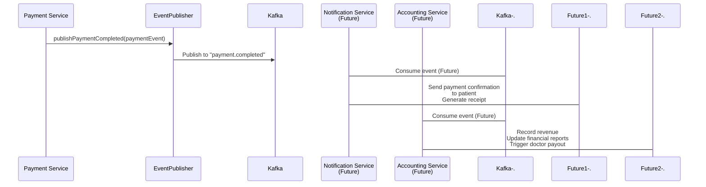

**Event Payload:**
```json
{
  "eventType": "payment.completed",
  "timestamp": "2026-01-21T10:15:00",
  "data": {
    "orderId": "ORD202601210001",
    "appointmentId": 123,
    "patientId": 10,
    "doctorId": 5,
    "amount": 500000,
    "currency": "VND",
    "paymentMethod": "MOMO_WALLET",
    "status": "COMPLETED",
    "transId": "12345678901",
    "completedAt": "2026-01-21T10:15:00"
  }
}
```

### Payment Failed Event

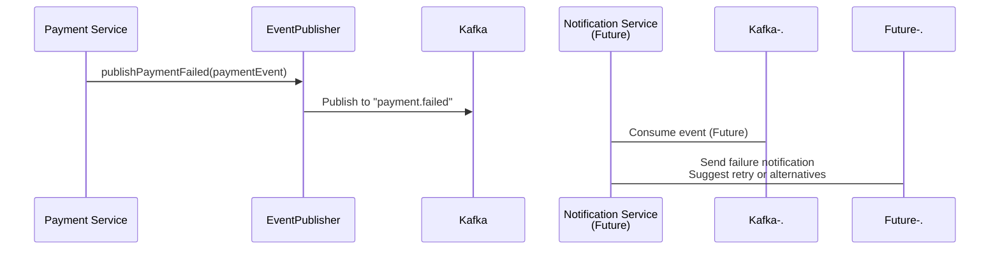

**Event Payload:**
```json
{
  "eventType": "payment.failed",
  "timestamp": "2026-01-21T10:15:00",
  "data": {
    "orderId": "ORD202601210002",
    "appointmentId": 124,
    "patientId": 11,
    "amount": 500000,
    "status": "FAILED",
    "errorMessage": "Insufficient balance",
    "errorCode": "1001"
  }
}
```

### Payment Refunded Event

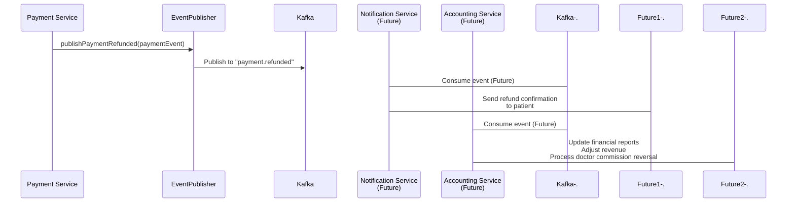

**Event Payload:**
```json
{
  "eventType": "payment.refunded",
  "timestamp": "2026-01-21T11:00:00",
  "data": {
    "orderId": "ORD202601210001",
    "appointmentId": 123,
    "patientId": 10,
    "amount": 500000,
    "status": "REFUNDED",
    "refundAmount": 500000,
    "refundReason": "Appointment cancelled by patient",
    "refundTransId": "REF12345678"
  }
}
```

## Kafka Configuration

### Producer Configuration

```yaml
spring:
  kafka:
    bootstrap-servers: localhost:9092
    producer:
      key-serializer: org.apache.kafka.common.serialization.StringSerializer
      value-serializer: org.springframework.kafka.support.serializer.JsonSerializer
      acks: all
      retries: 3
      properties:
        max.in.flight.requests.per.connection: 1
        enable.idempotence: true
```

### Consumer Configuration

```yaml
spring:
  kafka:
    bootstrap-servers: localhost:9092
    consumer:
      group-id: ${spring.application.name}-group
      auto-offset-reset: earliest
      key-deserializer: org.apache.kafka.common.serialization.StringDeserializer
      value-deserializer: org.springframework.kafka.support.serializer.JsonDeserializer
      properties:
        spring.json.trusted.packages: "*"
        max.poll.records: 10
        session.timeout.ms: 30000
```

## Event Processing Flow

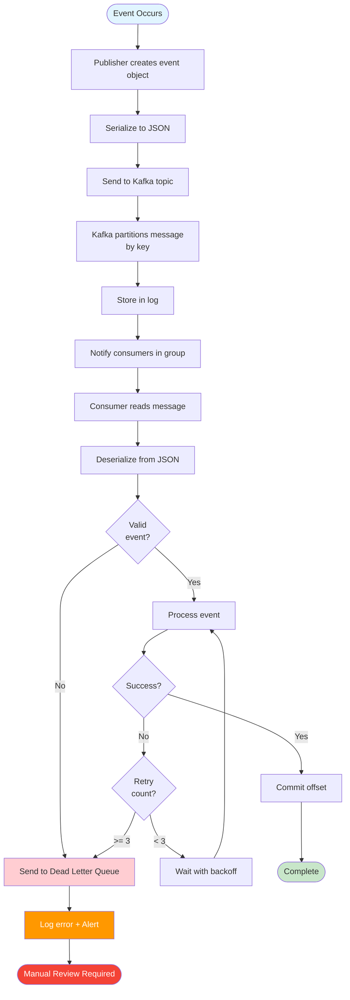

## Event Ordering and Partitioning

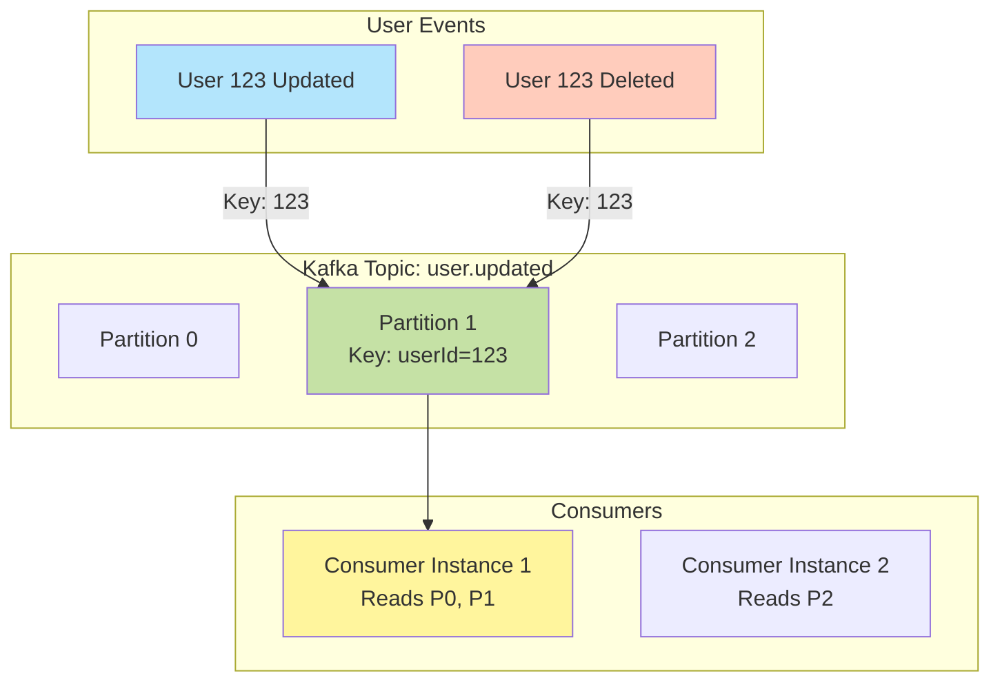

**Key Points:**
- Events for same entity (e.g., userId=123) go to same partition
- Maintains order within partition
- Different partitions can be processed in parallel
- Consumer group ensures each partition is read by only one consumer instance

## Error Handling and Dead Letter Queue

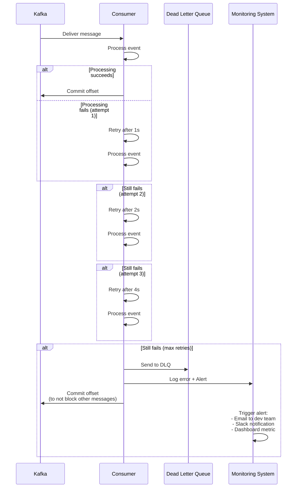

## Event Schema Evolution

```mermaid
flowchart TD
    V1[Version 1 Event:<br/>{userId, email, fullName}] --> Publish1[Published by old service]
    Publish1 --> Kafka[Kafka Topic]

    V2[Version 2 Event:<br/>{userId, email, fullName,<br/>phone, role}] --> Publish2[Published by new service]
    Publish2 --> Kafka

    Kafka --> Consumer[Consumer]
    Consumer --> Check{Check<br/>version?}

    Check -->|V1| HandleV1[Handle V1:<br/>Use default values<br/>for missing fields]
    Check -->|V2| HandleV2[Handle V2:<br/>Use all fields]

    HandleV1 --> Process[Process Event]
    HandleV2 --> Process

    style V1 fill:#ffcdd2
    style V2 fill:#c8e6c9
    style Process fill:#e1f5ff
```

**Backward Compatibility Strategy:**
- Add new fields with default values
- Never remove or rename existing fields
- Use optional fields for new features
- Version field in event payload for major changes

## Monitoring and Metrics

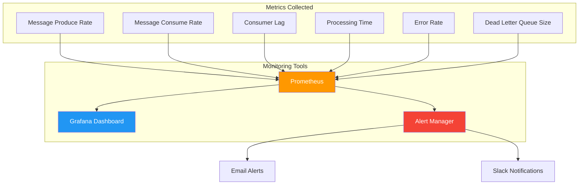

## Best Practices Summary

1. **Use meaningful event names** - `user.created`, `payment.completed`
2. **Include timestamp in all events** - For debugging and ordering
3. **Use consistent event structure** - `{eventType, timestamp, data}`
4. **Partition by entity ID** - Maintain order for same entity
5. **Implement idempotency** - Handle duplicate events gracefully
6. **Use Dead Letter Queue** - For failed messages
7. **Enable monitoring** - Track lag, error rates, throughput
8. **Version your events** - For backward compatibility
9. **Set appropriate retention** - Balance storage vs. replay ability
10. **Document event schemas** - Make it easy for consumers to integrate
