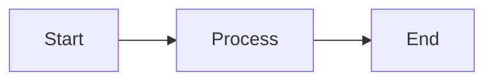

# Clinic Booking System - Diagrams Documentation

This folder contains comprehensive flow diagrams, sequence diagrams, and architecture diagrams for the Clinic Booking System.

## 📁 Diagram Files

| File | Description | Type |
|------|-------------|------|
| `01-architecture-overview.md` | System architecture and component overview | Architecture Diagram |
| `02-user-registration-flow.md` | User registration, login, and authentication flows | Sequence Diagrams |
| `03-appointment-booking-flow.md` | Appointment creation, update, cancel flows | Sequence + State Diagrams |
| `04-payment-processing-flow.md` | Payment with MoMo integration, refunds | Sequence + State Diagrams |
| `05-medical-record-flow.md` | Medical record and prescription management | Sequence + ER Diagrams |
| `06-inter-service-communication.md` | Feign clients and synchronous communication | Architecture + Sequence Diagrams |
| `07-event-driven-architecture.md` | Kafka events and asynchronous communication | Event Flow Diagrams |

## 🎨 Viewing Diagrams

### Method 1: GitHub (Recommended)
GitHub automatically renders Mermaid diagrams in Markdown files. Simply open any `.md` file on GitHub to see the rendered diagrams.

### Method 2: VS Code with Mermaid Extension
1. Install the **Markdown Preview Mermaid Support** extension in VS Code
2. Open any `.md` file
3. Press `Cmd+Shift+V` (Mac) or `Ctrl+Shift+V` (Windows) to preview

### Method 3: Mermaid Live Editor
1. Copy the Mermaid code from any file
2. Open [Mermaid Live Editor](https://mermaid.live/)
3. Paste the code to view and edit

### Method 4: Online Markdown Viewers
Use any online Markdown viewer that supports Mermaid:
- [StackEdit](https://stackedit.io/)
- [Dillinger](https://dillinger.io/)
- [HackMD](https://hackmd.io/)

## 🖼️ Converting to Images

### Option 1: Using Mermaid CLI

Install Mermaid CLI globally:
```bash
npm install -g @mermaid-js/mermaid-cli
```

Convert a single diagram:
```bash
# Navigate to this directory
cd docs/diagrams

# Convert to PNG
mmdc -i 01-architecture-overview.md -o output/architecture.png

# Convert to SVG (better quality)
mmdc -i 01-architecture-overview.md -o output/architecture.svg

# Convert to PDF
mmdc -i 01-architecture-overview.md -o output/architecture.pdf
```

Convert all diagrams (bash script):
```bash
#!/bin/bash
mkdir -p output

for file in *.md; do
    if [ "$file" != "README.md" ]; then
        basename="${file%.md}"
        echo "Converting $file..."
        mmdc -i "$file" -o "output/${basename}.png"
        mmdc -i "$file" -o "output/${basename}.svg"
    fi
done

echo "All diagrams converted to output/ folder"
```

Save this script as `convert-all.sh` and run:
```bash
chmod +x convert-all.sh
./convert-all.sh
```

### Option 2: Using Mermaid Live Editor
1. Open [Mermaid Live Editor](https://mermaid.live/)
2. Paste the Mermaid code
3. Click the download button
4. Choose format: PNG, SVG, or PDF

### Option 3: Using VS Code Extension
1. Install **Markdown Preview Mermaid Support** extension
2. Right-click on the preview
3. Select "Save as PNG" or "Copy as PNG"

### Option 4: Using Docker (No Node.js required)

```bash
# Pull the Mermaid CLI Docker image
docker pull minlag/mermaid-cli

# Convert diagram
docker run --rm -v $(pwd):/data minlag/mermaid-cli \
  -i /data/01-architecture-overview.md \
  -o /data/output/architecture.png
```

## 📊 Diagram Index

### 1. Architecture Overview
**File:** `01-architecture-overview.md`

**Contents:**
- System architecture with all microservices
- Database per service pattern
- Infrastructure components (Redis, Kafka)
- External integrations (MoMo, VNPay)
- Communication patterns

**Key Diagrams:**
- Component architecture diagram

---

### 2. User Registration & Authentication Flow
**File:** `02-user-registration-flow.md`

**Contents:**
- User registration flow with validation
- Login flow with JWT token generation
- Token refresh flow
- User created event flow

**Key Diagrams:**
- Registration sequence diagram
- Login sequence diagram
- Token refresh sequence diagram
- Event flow diagram

**Error Cases:**
- Duplicate email/phone
- Invalid credentials
- Account locked
- Invalid token

---

### 3. Appointment Booking Flow
**File:** `03-appointment-booking-flow.md`

**Contents:**
- Complete appointment booking flow
- Doctor schedule validation
- Appointment update flow
- Appointment cancellation (soft delete)
- Status lifecycle

**Key Diagrams:**
- Create appointment sequence diagram
- Update appointment sequence diagram
- Delete appointment sequence diagram
- Appointment status state diagram
- Doctor schedule validation flowchart

**Validation Rules:**
- Duration: 15-180 minutes
- Not in past
- Not beyond 3 months
- Doctor working hours
- No time conflicts

---

### 4. Payment Processing Flow
**File:** `04-payment-processing-flow.md`

**Contents:**
- Payment creation with MoMo integration
- MoMo callback webhook processing
- Query payment status flow
- Refund processing flow
- Payment status lifecycle

**Key Diagrams:**
- Create payment sequence diagram
- MoMo callback sequence diagram
- Query status sequence diagram
- Refund flow sequence diagram
- Payment status state diagram
- Signature verification flowchart

**Security Features:**
- HMAC-SHA256 signature verification
- Pessimistic locking for idempotency
- Request/response logging
- IP address tracking

---

### 5. Medical Record Flow
**File:** `05-medical-record-flow.md`

**Contents:**
- Create medical record with prescriptions
- Add prescription to existing record
- Get patient medical records
- Update medical record
- Medication catalog usage

**Key Diagrams:**
- Create medical record sequence diagram
- Add prescription sequence diagram
- Get records sequence diagram
- Update record sequence diagram
- Medication catalog flowchart
- Database ER diagram

**Authorization:**
- PATIENT: View own records only
- DOCTOR: Create/update own records only
- ADMIN: Full access

---

### 6. Inter-Service Communication
**File:** `06-inter-service-communication.md`

**Contents:**
- Feign client architecture
- Circuit breaker patterns
- Fallback strategies
- Service dependencies
- Retry mechanisms
- Load balancing

**Key Diagrams:**
- Feign client architecture diagram
- Circuit breaker sequence diagram
- Error handling flowchart
- Service dependencies graph
- Circuit breaker state diagram
- Retry strategy flowchart

**Configuration:**
- Connect timeout: 5 seconds
- Read timeout: 5 seconds
- Circuit breaker threshold: 50% failure rate
- Fallback enabled for all clients

---

### 7. Event-Driven Architecture
**File:** `07-event-driven-architecture.md`

**Contents:**
- Kafka event flow overview
- All event types and payloads
- Event consumers
- Error handling and DLQ
- Event ordering and partitioning
- Schema evolution

**Key Diagrams:**
- Event flow overview diagram
- User events sequence diagrams
- Appointment events sequence diagrams
- Medical record events sequence diagrams
- Payment events sequence diagrams
- Event processing flowchart
- Partitioning diagram
- DLQ error handling sequence

**Event Topics:**
- `user.created`, `user.updated`, `user.deleted`
- `appointment.created`, `appointment.updated`, `appointment.cancelled`
- `medical_record.created`, `medical_record.updated`
- `payment.created`, `payment.completed`, `payment.failed`, `payment.refunded`

---

## 🎯 Use Cases for Each Diagram

### For Developers
- **Architecture Overview**: Understanding system structure
- **Sequence Diagrams**: Implementing API endpoints
- **State Diagrams**: Managing entity lifecycle
- **Flowcharts**: Implementing validation logic

### For DevOps
- **Architecture Overview**: Infrastructure setup
- **Inter-Service Communication**: Service mesh configuration
- **Event-Driven Architecture**: Kafka setup and monitoring

### For QA/Testers
- **Sequence Diagrams**: Writing test cases
- **Error Handling Sections**: Testing error scenarios
- **State Diagrams**: Testing state transitions

### For Project Managers
- **Architecture Overview**: Understanding system capabilities
- **All Flows**: Understanding business processes
- **Error Cases**: Understanding failure scenarios

### For Documentation
- **All Diagrams**: Technical documentation
- **Architecture Overview**: System design document
- **Event Payloads**: API integration guide

---

## 🔧 Customization

All diagrams are created using Mermaid syntax, which is easy to edit:

1. Open any `.md` file
2. Find the Mermaid code block (between ` ```mermaid` and ` ``` `)
3. Edit the code
4. Preview to see changes

Example Mermaid syntax:


Mermaid supports:
- **Flowcharts**: `graph`, `flowchart`
- **Sequence Diagrams**: `sequenceDiagram`
- **State Diagrams**: `stateDiagram-v2`
- **ER Diagrams**: `erDiagram`
- **Class Diagrams**: `classDiagram`
- And more...

See [Mermaid Documentation](https://mermaid.js.org/) for full syntax.

---

## 📝 Adding New Diagrams

To add a new diagram:

1. Create a new `.md` file in this directory
2. Use the same structure as existing files:
   ```markdown
   # Title

   ## Section 1

   ```mermaid
   graph TD
       A --> B
   ```

   Description...
   ```

3. Update this README with the new diagram
4. Convert to images if needed

---

## 🤝 Contributing

To improve these diagrams:

1. Edit the Mermaid code in the `.md` files
2. Test the rendering (GitHub, VS Code, or Mermaid Live)
3. Ensure consistency with existing diagram style
4. Update this README if adding new diagrams

---

## 📚 Additional Resources

- [Mermaid Documentation](https://mermaid.js.org/)
- [Mermaid Live Editor](https://mermaid.live/)
- [Mermaid Cheat Sheet](https://jojozhuang.github.io/tutorial/mermaid-cheat-sheet/)
- [Clinic Booking System README](../../README.md)
- [CRUD Implementation Guide](../../README_CRUD_IMPLEMENTATION.md)

---

**Created:** January 21, 2026
**Status:** ✅ Complete
**Total Diagrams:** 7 files with 40+ diagrams
**Format:** Mermaid (Markdown)
**Viewable on:** GitHub, VS Code, Mermaid Live Editor
